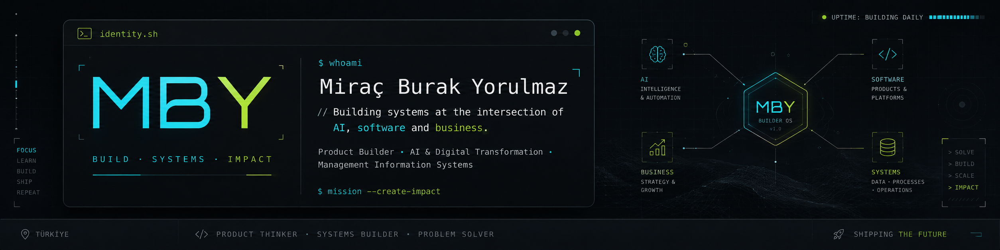

<div align="center">
  
</div>

<br>

<h1 align="center">Miraç Burak Yorulmaz</h1>

<p align="center">
  <b>Product Builder · AI & Digital Transformation · Information Systems</b>
</p>

<p align="center">
  I build systems that turn ideas, workflows and knowledge into usable products.
</p>

<p align="center">
  <a href="https://miractandunyaya.com">
    
  </a>
  <a href="https://www.linkedin.com/in/miracburakyorulmaz">
    
  </a>
  <a href="mailto:mbyorulmaz@gmail.com">
    
  </a>
</p>

---

## About

I'm a **Management Information Systems student at Sakarya University** working at the intersection of **software, artificial intelligence and business systems**.

I’m especially interested in projects where technology can:

* automate professional workflows,
* preserve and organize knowledge,
* improve business processes,
* connect AI with real-world systems,
* and grow beyond a prototype into something people can actually use.

I prefer building end-to-end:

```text
idea → research → architecture → build → test → ship → iterate
```

My goal is not to collect repositories.

**I want to build systems that become useful outside GitHub.**

---

## What I Build

### AI Systems

I explore how AI can move beyond chat interfaces and become part of structured workflows.

Current interests include:

* AI agents
* Digital workers
* Professional memory
* Tool-based execution
* Workflow automation
* Evidence-grounded outputs
* Human + AI collaboration

### Digital Products

I build full-stack products with a focus on real usage rather than isolated demos.

That usually means working across:

* product thinking,
* frontend,
* backend,
* databases,
* authentication,
* administration systems,
* deployment,
* and iteration.

### Information Systems

My MIS background shapes the way I approach software.

I care not only about:

> **Can we build this?**

but also:

> **Who needs it, how does it fit into the process, and what problem does it actually solve?**

---

# Selected Work

## 🤖 Adaptive Professional Digital Worker

**A role-based AI worker designed around professional capability, persistent memory and controlled execution.**

The project explores how a digital worker can perform structured professional tasks while maintaining evidence-based skill progression and reusable professional memory.

**Key areas**

* persistent professional memory
* deterministic business tools
* evidence-grounded reports
* capability and skill evaluation
* session-to-session recall
* security-aware execution boundaries
* typed AI workflows

**Stack**

`Python` · `FastAPI` · `LangGraph` · `PostgreSQL` · `OpenAI`

[View repository →](https://github.com/miracyorulmaz/digital-worker-poc)

---

## 🌍 Miraç'tan Dünyaya — Builder OS

**My personal publishing and project operating system.**

Instead of creating a traditional portfolio, I built my own platform for publishing projects, research and academic notes while managing everything through a custom administration system.

**Key areas**

* project publishing
* research & notes
* custom administration panel
* content visibility and ordering
* responsive experience
* production deployment
* personal digital identity

**Stack**

`React` · `TypeScript` · `Vite` · `Node.js` · `PostgreSQL` · `Vercel`

[Visit miractandunyaya.com →](https://miractandunyaya.com)

[View repository →](https://github.com/miracyorulmaz/miractandunyaya-builder-os)

---

## ⚽ Juventus Academy Platform

**A production-oriented digital platform for Juventus Academy Batıkent.**

The system combines a public-facing academy website with administrative workflows and real registration infrastructure.

**Key areas**

* content management
* admin authentication
* registration applications
* media storage
* email notifications
* database access policies
* secure server-side workflows

**Stack**

`Next.js` · `TypeScript` · `Supabase` · `PostgreSQL` · `Vercel`

[View repository →](https://github.com/miracyorulmaz/Juventus)

---

## 📚 YBS Vault

**A growing knowledge base for Management Information Systems and technical learning.**

The goal is to turn coursework and technical study into reusable, structured knowledge rather than notes that disappear after an exam.

**Topics**

`SQL` · `Databases` · `Information Systems` · `Data Structures` · `Operations Research` · `Enterprise Systems`

[View repository →](https://github.com/miracyorulmaz/ybs-vault)

---

# Technology

### Languages


### Product Development


### Data & Infrastructure


### AI


---

# Current Focus

I'm currently deepening my work around:

**01 — Applied AI**

Moving from generic AI interfaces toward systems that can perform structured, traceable work.

**02 — Enterprise Systems**

Understanding how software, data and AI fit into real organizational processes.

**03 — Product Engineering**

Improving my ability to take a product from architecture to production.

**04 — Knowledge Systems**

Exploring ways to structure, preserve and reuse both human and AI knowledge.

---

# How I Think About Building

```text
BUILD
  ↓
MEASURE
  ↓
LEARN
  ↓
IMPROVE
  ↓
SHIP AGAIN
```

I value:

**usefulness over complexity**
**systems over isolated features**
**evidence over assumptions**
**shipping over endless polishing**

---

<div align="center">

## Build systems. Ship products. Create impact.

<br>

<a href="https://miractandunyaya.com">
  <b>miractandunyaya.com</b>
</a>

<br><br>

<sub>
Miraç Burak Yorulmaz · Türkiye
</sub>

</div>
